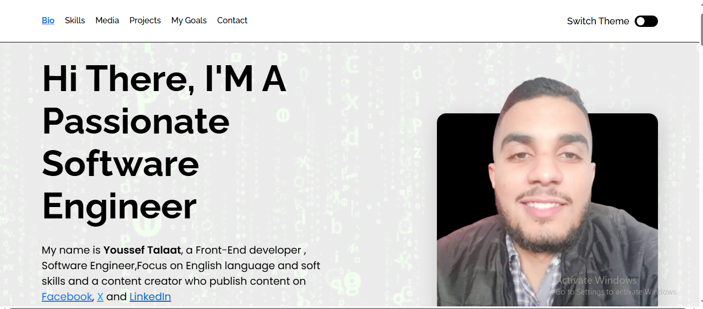

<h1 align="center">🔥 Youssef Talaat – Personal Portfolio Website</h1>

A modern, responsive portfolio built with <strong>HTML</strong>, <strong>CSS (SASS)</strong>, and custom design. Featuring theme switching, clean layout, and a strong focus on front-end skills, soft skills, and personal branding. 

<h2>📸 Preview</h2>

  

<h2>📱 Mobile-Friendly</h2>
<ul>
  <li>✅ Fully responsive on mobile, tablet, and desktop</li>
  <li>✅ Clean and modern layout with consistent spacing</li>
  <li>✅ Hamburger menu & dark/light theme toggle 🌗</li>
</ul>

<h2>🛠️ Tech Stack</h2>
<ul>
  <li>🧱 HTML5 (semantic structure)</li>
  <li>🎨 SASS (SCSS syntax, variables, mixins)</li>
  <li>⚙️ CSS3 features (custom properties, `:has()`, animations)</li>
  <li>📱 Mobile-first & responsive design</li>
</ul>

<h2>🚀 Live Website</h2>

🌐 Check it out here: <a href="https://yousseftalaat-collab.github.io/youssef-talaat-portfolio/" target="_blank">Live Portfolio</a>

📂 GitHub Repo: <a href="https://github.com/Yousseftalaat-collab/youssef-talaat-portfolio" target="_blank">Portfolio on GitHub</a>

<h2>📂 Sections Included</h2>
<ul>
  <li>👨‍💻 Bio</li>
  <li>🧠 Skills</li>
  <li>🎬 Media (video section)</li>
  <li>📂 Projects (Quran Tab & Quran Station)</li>
  <li>🎯 My Mission</li>
  <li>📞 Contact with social links</li>
</ul>

<h2>🧠 What I Practiced</h2>
<ul>
  <li>Semantic HTML5 structure & accessibility</li>
  <li>Responsive layouts using CSS Grid and Flexbox</li>
  <li>CSS animations & transitions</li>
  <li>Dark/Light theme using pure CSS + `:has()` selector</li>
</ul>

<h2>🧪 How to Run</h2>
<ol>
  <li>📥 Clone or download the repository</li>
  <li>📂 Open <code>index.html</code> in your browser</li>
  <li>✅ That's it! No dependencies needed</li>
</ol>

<h2>💬 Contact</h2>

📧 Email: <a href="mailto:yousseftalaat142@gmail.com">yousseftalaat142@gmail.com</a>

🔗 LinkedIn: <a href="https://www.linkedin.com/in/youssef-talaat-1aa2671b3/">Youssef Talaat</a>

🐱 GitHub: <a href="https://github.com/Yousseftalaat-collab">Yousseftalaat-collab</a>

---

<h3 align="center">✨ Created & Maintained by <strong>Youssef Talaat</strong></h3>

